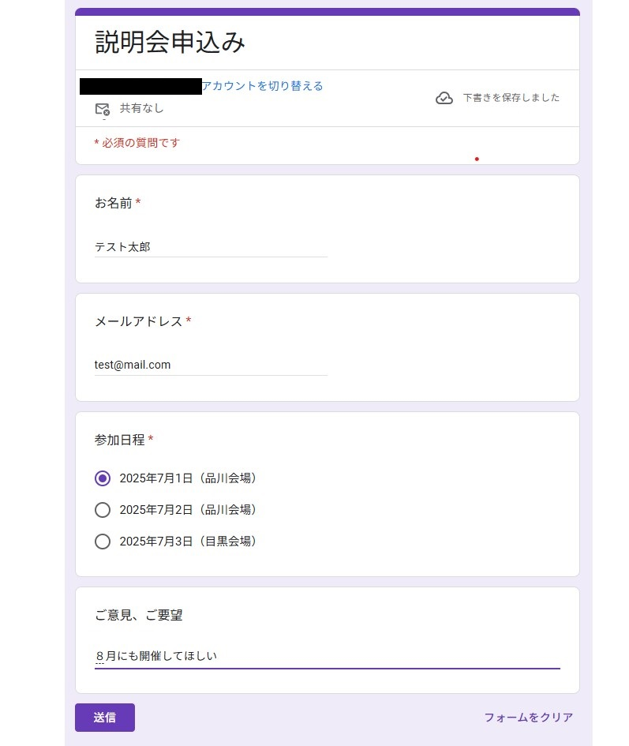
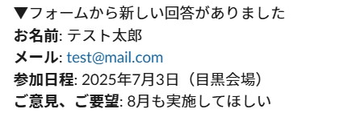
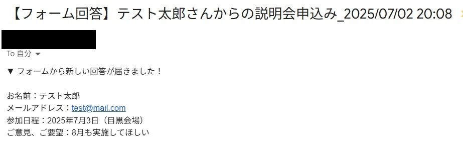

# Googleフォーム自動通知ツール（メール & Slack連携）
Googleフォームへの回答をトリガーに、主催者へ**メール送信とSlack通知を自動で行うツール**です。  
Google Apps Script（GAS）を使用しており、フォーム回答の確認を効率化できます。

---

## 機能概要
- Googleフォームの回答送信時に以下を自動実行：
  - 回答内容を**主催者へメールで通知**
  - 同じ内容を**Slackに自動投稿**
- Slack通知に失敗した場合は**主催者にエラーメール通知**

---

## フォーム想定項目
・お名前
・メールアドレス
・参加日程
・ご意見、ご要望
※ フォームの質問文と完全一致させてください。

---

## 使用方法
1. Googleフォームを作成し、上記の質問項目を用意
2. メニュー「拡張機能」→「Apps Script」でスクリプトエディタを開く
3. このリポジトリのコード（`Code.gs`）を貼り付け
4. 以下の2点を自分用に変更：
    - `myEmail`（通知を受け取る主催者のメールアドレス）
    - `slackWebhookUrl`（SlackのIncoming Webhook URL）
5. メニューの「トリガー」から以下を設定：
    - 関数：`onFormSubmit`
    - イベントの種類：`フォーム送信時（From form）`

---

## slack通知サンプル

---

### メール通知サンプル

---

## 必要な権限
スクリプト初回実行時に、以下の権限許可が求められます：
- メールの送信（MailApp）
- 外部サービスとの通信（Slack通知用：UrlFetchApp）

---

## 注意点

- Slack通知が失敗した場合、エラーメールが主催者に送信されます
- フォームの質問項目名が変更されると正常に動作しない可能性があります

---
